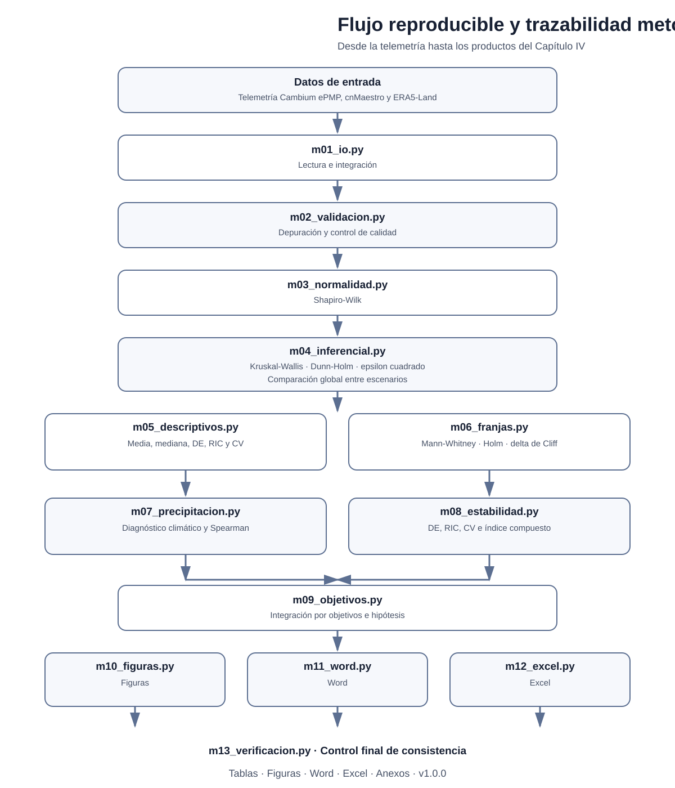

# Evaluación experimental del desempeño técnico de un radioenlace rural

Repositorio científico asociado a una investigación sobre la relación entre la configuración técnica de un radioenlace punto a punto y su desempeño bajo condiciones reales de operación en un entorno rural altoandino de Cajamarca, Perú.

## Objetivo general

Evaluar la asociación entre la configuración técnica del radioenlace y su desempeño técnico bajo condiciones reales de operación.

## Objetivos específicos

1. Comparar el desempeño técnico entre los escenarios E0–E5.
2. Comparar el desempeño entre las franjas 20:00–22:00 y 01:00–03:00.
3. Analizar la asociación entre precipitación horaria y métricas técnicas.
4. Identificar la configuración con mayor estabilidad operativa.

## Escenarios

| Escenario | Frecuencia | Ancho de canal |
|---|---:|---:|
| E0 | 5800 MHz | 20 MHz |
| E1 | 5660 MHz | 40 MHz |
| E2 | 5660 MHz | 80 MHz |
| E3 | 5730 MHz | 40 MHz |
| E4 | 5730 MHz | 80 MHz |
| E5 | 5805 MHz | 40 MHz |

## Métricas

RSSI DL, SNR DL, MCS DL, Throughput DL observado, DE, RIC, CV, índice compuesto de estabilidad y precipitación horaria.

## Flujo

```text
Telemetría + cnMaestro + ERA5-Land
                ↓
Depuración y homologación
                ↓
Sincronización temporal
                ↓
Dataset consolidado
                ↓
Shapiro–Wilk
                ↓
Kruskal–Wallis + ε²
                ↓
Dunn + Holm
                ↓
Mann–Whitney + Holm + delta de Cliff
                ↓
Spearman
                ↓
Índice compuesto de estabilidad
                ↓
CSV + figuras + Word + Excel
```

## Instalación

```bash
python -m pip install -r requirements.txt
```

## Ejecución en Windows

```bat
ejecutar_pipeline_RC5.bat
```

Verifique que el nombre coincida con el lanzador definitivo del repositorio.

## Documentación

- `docs/metodologia.md`
- `docs/pipeline_estadistico.md`
- `docs/estructura_datos.md`
- `docs/reproducibilidad.md`

## Seguridad

No publique credenciales, tokens, claves, direcciones IP de administración ni archivos con información personal.

## Licencia

Código bajo licencia MIT.

<!-- TRACEABILITY:START -->
## Reproducibilidad y trazabilidad científica

Este repositorio contiene el flujo computacional utilizado para procesar la telemetría del radioenlace y generar los análisis estadísticos, tablas, figuras y reportes empleados en la investigación.

<p align="center">
  
</p>

### Correspondencia metodológica

| Procedimiento de la tesis | Módulo |
|---|---|
| Configuración del pipeline | `pipeline_rc1/m00_config.py` |
| Lectura e integración de datos | `pipeline_rc1/m01_io.py` |
| Validación y depuración | `pipeline_rc1/m02_validacion.py` |
| Shapiro-Wilk | `pipeline_rc1/m03_normalidad.py` |
| Kruskal-Wallis, Dunn-Holm y epsilon cuadrado | `pipeline_rc1/m04_inferencial.py` |
| Estadísticos descriptivos | `pipeline_rc1/m05_descriptivos.py` |
| Mann-Whitney, Holm y delta de Cliff | `pipeline_rc1/m06_franjas.py` |
| Precipitación y Spearman | `pipeline_rc1/m07_precipitacion.py` |
| DE, RIC, CV e índice compuesto | `pipeline_rc1/m08_estabilidad.py` |
| Integración por objetivos | `pipeline_rc1/m09_objetivos.py` |
| Generación de figuras | `pipeline_rc1/m10_figuras.py` |
| Generación del reporte Word | `pipeline_rc1/m11_word.py` |
| Generación del reporte Excel | `pipeline_rc1/m12_excel.py` |
| Verificación final | `pipeline_rc1/m13_verificacion.py` |
| Ejecución integral | `pipeline_rc1/main.py` |

### Productos reproducibles

La ejecución del pipeline genera tablas estadísticas, resultados descriptivos e inferenciales, tamaños del efecto, análisis por franjas horarias, análisis de precipitación, indicadores de estabilidad, figuras en alta resolución y reportes Word y Excel.

### Ejecución

```bat
python -m pip install -r requirements.txt
ejecutar_pipeline_RC5.bat
```

### Alcance

El repositorio reproduce el procesamiento y el análisis a partir de los archivos de entrada requeridos. Los datos crudos completos pueden mantenerse fuera del control de versiones por restricciones de tamaño, seguridad o confidencialidad. La estructura esperada se documenta en `docs/estructura_datos.md`.

### Versión asociada con la tesis

`v1.0.0`

https://github.com/carloskoo1/rural-radio-link-performance/tree/v1.0.0
<!-- TRACEABILITY:END -->


